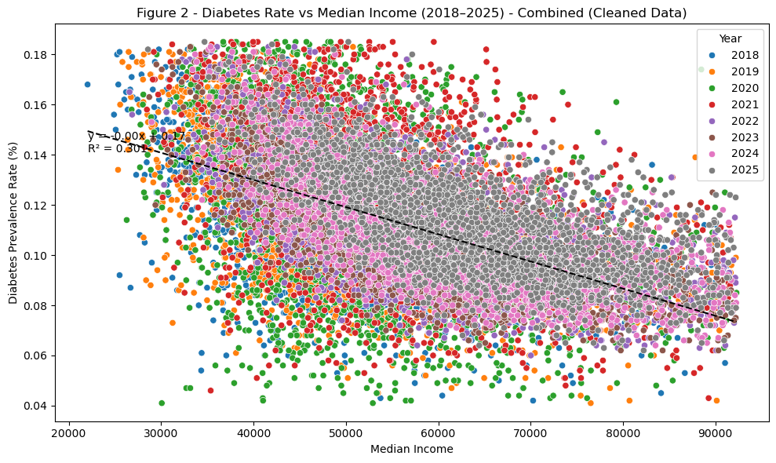

# Does Higher Household Income Predict Lower Diabetes Prevalence in U.S. Counties?

A county-level analysis of the relationship between median household income and diabetes prevalence across the United States (2018-2025), controlling for educational attainment and food environment quality.

[Read the rendered analysis](ECON%20220%20Final%20Report%20%281%29.html) |
[Open the notebook](analysis.ipynb)

## Results at a glance

| Coverage | Annual correlations | Adjusted income estimate | Controlled model |
|---:|---:|---:|---:|
| 8 years, 23,000+ county-years | r = -0.42 to -0.67 | -0.86pp diabetes per +$10,000 income | R² = 0.324 |



*The negative relationship appears in every annual sample. The model describes
county-level associations and does not establish that income changes cause
changes in diabetes prevalence.*

## Overview

This project investigates whether economic disadvantage predicts higher diabetes rates using publicly available data from the [County Health Rankings & Roadmaps](https://www.countyhealthrankings.org/) (CHR). The analysis covers **8 years** of data across **~3,000 U.S. counties per year** (~23,000+ observations after cleaning).

### Key Findings

- **Strong negative correlation** between median income and diabetes prevalence (Pearson r = -0.42 to -0.67, p < 0.001 in all years)
- **Each $10,000 increase** in median household income is associated with a ~0.86 percentage point decrease in diabetes prevalence
- The relationship **persists after controlling** for high school graduation rates and food environment quality (R^2 = 0.324)
- **COVID-19 disruption** visible in 2020-2021 data (weakened but still significant correlations)

## Project Structure

```
.
├── analysis.ipynb                     # Main analysis notebook
├── analytic_data{2018-2025}.csv       # Annual county-level datasets from CHR
├── DataDictionary_{2018-2025}.xlsx    # Variable definitions for each year
└── README.md
```

## Variables

| Variable | Description | Source |
|----------|-------------|--------|
| `diabetes_rate` | % of adults 18+ with diagnosed diabetes | CDC via CHR |
| `median_income` | Median household income (USD) | Census Bureau via CHR |
| `hs_graduation_rate` | % of adults 25+ with high school diploma | Census Bureau via CHR |
| `food_env_index` | Food environment quality (0=worst, 10=best) | USDA via CHR |

## Methods

1. **Data harmonization**: Standardized column names across 8 years of CHR data releases (naming conventions changed between years)
2. **Cleaning**: Converted to numeric, dropped rows with missing values in key variables
3. **Outlier removal**: IQR method (1.5x) applied to median income and diabetes rate
4. **Analysis**:
   - Pearson correlation (year-by-year and combined)
   - OLS multiple linear regression with education and food access controls
   - Hypothesis testing on the income coefficient

## Requirements

```
python >= 3.9
pandas
numpy
matplotlib
seaborn
scipy
statsmodels
```

Install with:

```bash
pip install pandas numpy matplotlib seaborn scipy statsmodels
```

## Data Source

All data is publicly available from the **County Health Rankings & Roadmaps** program, a collaboration between the Robert Wood Johnson Foundation and the University of Wisconsin Population Health Institute.

- Data download: https://www.countyhealthrankings.org/health-data/methodology-and-sources/data-documentation
- Data dictionaries included in the repository for each year

## Author

**Shunji Lewandowski**
Economics and Human Health Joint Major, Emory University

## License

This project uses publicly available data. The analysis code is available for educational and research purposes.
